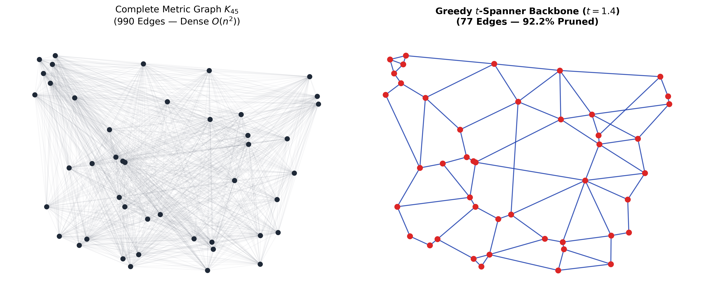
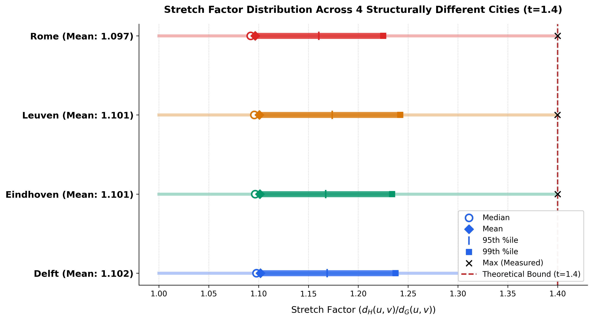

# Geometric Spanners Lab: Greedy $t$-Spanner Benchmark

  
  
  

A clean, reproducible research implementation and benchmarking lab for **Greedy $t$-Spanner Construction Algorithms** on 2D metric spaces.

---

## 📌 Theoretical Foundations

Given a complete geometric metric graph $G = (V, E)$ embedded in Euclidean space $\mathbb{R}^2$, a subgraph $H = (V, E_H)$ is defined as a **$t$-spanner** if:

$$\forall u, v \in V, \quad d_H(u, v) \le t \cdot d_G(u, v)$$

where $t \ge 1$ represents the **stretch factor** (dilation bound). 

The classical **Greedy Algorithm** sorts all candidate edges by ascending Euclidean length and adds an edge $(u, v)$ to $H$ if and only if the current shortest path distance in $H$ satisfies:

$$d_H(u, v) > t \cdot \|p_u - p_v\|_2$$

---

## 📊 Empirical Baseline ($n = 45, t = 1.40$)

| Metric Property | Complete Dense Graph ($K_{45}$) | Greedy $t$-Spanner ($H$) | Sparsity / Reduction |
| :--- | :---: | :---: | :---: |
| **Total Edges** | **990** | **77** | **92.22% Pruned** |
| **Stretch Factor ($t$)** | 1.00 | $\le 1.40$ | *Strict Invariant* |
| **Asymptotic Density** | $\mathcal{O}(n^2)$ | $\mathcal{O}(n)$ | Sparse Backbone |

 

  

---

## 🚀 Quickstart & Reproducibility

    # 1. Clone the repository
    git clone https://github.com/soheylfalahzade/geometric-spanners-lab.git
    cd geometric-spanners-lab

    # 2. Install dependencies
    pip install -r requirements.txt

    # 3. Run the benchmark
    python greedy_spanner.py

---

## 📄 License
This project is licensed under the MIT License.
---

## 🌍 Real-World Validation (OpenStreetMap Road Networks)

The synthetic baseline above uses randomly distributed points. To test whether the same construction holds on real, structurally different urban topologies, the benchmark was extended to actual road networks (via OSMnx) for four cities:

| City | Nodes | Full Graph Edges | Spanner Edges | % Pruned | Verified Max Stretch |
|---|---|---|---|---|---|
| Delft, NL | 1,285 | 824,970 | 2,554 | 99.69% | 1.39997 |
| Eindhoven, NL | 1,332 | 886,446 | 2,610 | 99.71% | 1.39998 |
| Leuven, BE | 886 | 392,055 | 1,703 | 99.57% | 1.39975 |
| Rome, IT | 1,129 | 636,756 | 2,239 | 99.65% | 1.39997 |

**Independently verified stretch distribution** (Delft, all 824,970 pairs — not just the algorithm's own target):

| Statistic | Value |
|---|---|
| Mean | 1.102 |
| Median | 1.098 |
| 99th percentile | 1.237 |
| Max (measured, not assumed) | 1.39997 |

**Finding:** despite very different street topologies (canal-based Delft, planned-grid Eindhoven, medieval-organic Leuven, ancient-chaotic Rome), the stretch distribution is nearly identical across all four cities. Topology does not appear to be the dominant factor at this scale (800–1,300 nodes) — full verification code and distribution histograms are in `osm_experiments/`.

